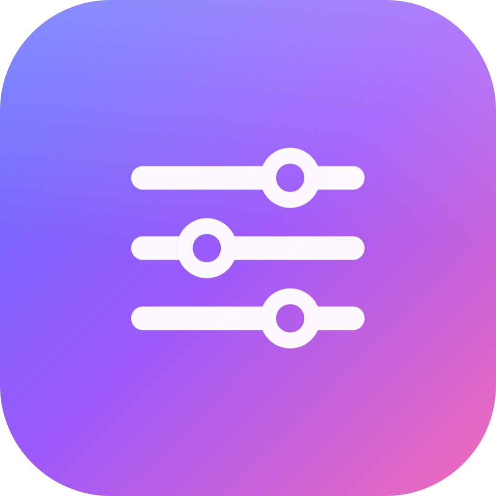

# MacTweak

A premium, **Apple-like menu-bar tweak tool for macOS** — think GNOME Tweaks, but
native SwiftUI with an apple.com-grey, single-accent design. Toggle reversible system
optimizations, watch live CPU/RAM, benchmark the gain, and run a guided setup that
tailors everything to how *you* use your Mac.

> Personal build. **Not sandboxed** and locally (ad-hoc) signed, because it drives
> `pmset`, `mdutil`, `launchctl`, and `defaults` and escalates through the native
> macOS password prompt — none of which is possible inside the App Sandbox.



## Features

- **Dashboard** — live CPU & memory ring gauges (read straight from the Mach kernel,
  no shelling out; CPU smoothed so the menu and window stay consistent), a rolling
  90-second chart, and system facts.
- **30 tweaks** across 7 categories (Performance, Power, Snappiness, Privacy, Background
  Services, Network, AI & Intelligence) — CPU/GPU speed (raise GPU memory limit,
  unthrottle background I/O, server performance mode), RAM/GPU responsiveness (reduce
  transparency & motion), Finder/Dock snappiness (faster Mission Control, instant dock,
  no smooth-scroll, manual tabbing), and AI/bloat daemons (media/photo analysis, Siri,
  proactive intelligence/`duetexpertd`). Each has its **own SF Symbol icon**, is
  **reversible**, and shows a risk badge, live applied/stock state, and whether it needs
  admin or SIP-off. Advanced-risk tweaks confirm before enabling.
- **Presets** — one-tap bundles (Balanced · Performance · Snappy UI · Battery · Privacy)
  that only include real, available tweaks (SIP-blocked and advanced ones are excluded).
- **Guided Setup** — a short wizard that asks how you use your Mac (AI, Spotlight,
  Photos, AirDrop, priority…) and builds a tailored set that never disables things
  you rely on.
- **Benchmark** — single-core, multi-core, memory-bandwidth and disk micro-benchmarks.
  Run a *Baseline*, apply tweaks, run *After tweaks*, and see the delta in a chart.
- **Quick Actions** — one-shot maintenance: purge inactive memory, flush DNS, restart
  Dock/Finder, purge bloat daemons, rebuild Spotlight, and **generate an emergency
  revert script** (`~/Documents/MacTweak_Revert.sh`) that undoes everything from Terminal.
- **Menu-bar panel** — live CPU/MEM tiles + a labelled sparkline (shows % used), quick
  toggles for your favorites, and Apply Recommended with an inline result message.
- **Favorites & reordering** — pin tweaks (★) for the menu-bar panel, drag to reorder
  within a category. Order and favorites persist.

## Build & run

Requirements: **macOS 15+** and **Xcode 16+** (uses Swift 6 / Swift Charts).

```bash
# compile, bundle into build/MacTweak.app, and launch
Scripts/build_app.sh run

# just build the .app
Scripts/build_app.sh
```

Or open `Package.swift` in Xcode and hit Run (note: running the bare SPM executable
skips the `Info.plist`, so use the script for the real menu-bar experience).

The app lives in the **menu bar** (no Dock icon). The main window opens on first launch
and via the menu-bar panel's *Open MacTweak*.

## How privileges work

User-level tweaks (`defaults`, `launchctl … gui/$UID`) run without a prompt. Admin
tweaks run root either through `osascript … with administrator privileges` (native auth
dialog — no helper tool, no stored password, no deprecated API) or, once you've unlocked
passwordless admin (below), silently via `sudo -n`. The engine re-probes the real state
after every change, so a tweak is only shown *Applied* if the system actually changed —
it never trusts an exit code. See `Sources/MacTweak/Core/CommandRunner.swift` and
`TweakEngine.swift`.

## Passwordless admin (authenticate once)

By default each admin tweak triggers the native password prompt. Click **Unlock**
on the Dashboard's *Admin Access* card to authenticate **once** — MacTweak installs
a sudoers rule and every later admin tweak applies via `sudo -n` with no prompt.

- The rule lives at `/etc/sudoers.d/mactweak` (root-owned, `0440`, validated with
  `visudo -c` before it's kept).
- **Lock** removes it. Manual removal: `sudo rm /etc/sudoers.d/mactweak`.
- **Security note:** the rule grants your user passwordless root (`NOPASSWD: /bin/zsh`),
  which is what makes the tweaks silent. That's a real convenience-for-safety trade —
  fine for a personal machine, but any process running as you can then reach root
  without a password. Lock it when you're done tuning if that matters to you.

## Adding a tweak

Add one entry to `TweakCatalog.all` in
`Sources/MacTweak/Models/TweakCatalog.swift`:

```swift
Tweak(
    key: "my-tweak",
    title: "Human title",
    summary: "One line of what it does.",
    category: .performance, privilege: .admin, risk: .safe, sipRequired: false,
    applyCommand:  "sysctl -w some.knob=0",
    revertCommand: "sysctl -w some.knob=1",
    statusCommand: "sysctl -n some.knob",
    appliedWhenOutputContains: "0",   // stdout contains this → shown as Applied
    tags: [.prioritizePerformance], recommended: true
)
```

Give it a distinct icon with a one-line entry in `TweakCatalog.iconOverrides`
(`"my-tweak": "sparkles"`); it falls back to the category glyph if omitted. All
commands are verified against real macOS output — the app rejects tweaks that reference
sysctls/keys that don't exist rather than shipping dead toggles.

## Safety

- Everything is reversible. **Dashboard → Revert All** restores stock in one click.
- Admin/SIP tweaks are clearly badged. On a SIP-enabled Mac, SIP-required tweaks show
  as *Unavailable* and can't be toggled.
- All commands were verified against macOS 26 output formats.

## Regenerating the icon

```bash
swift Scripts/make_icon.swift Resources/AppIcon.png
# then rebuild the .icns (see the iconset steps) and run build_app.sh
```

## Layout

```
Sources/MacTweak/
  App/        MacTweakApp, AppModel (+ wizard logic), Theme (design system)
  Core/       CommandRunner (user/admin/passwordless), SystemInfo, TweakEngine
  Models/     Tweak, TweakCategory, TweakCatalog (+ iconOverrides), Presets
  Metrics/    SystemMetrics (Mach sampling, EMA-smoothed CPU), Benchmark
  Views/      Dashboard, TweakList/Row, Benchmark, Actions, Sidebar, Menu,
              Components (HeroHeader, RingGauge/StatTile, cpuHistoryMarks)
  Onboarding/ OnboardingView
Scripts/      build_app.sh, make_icon.swift
```
