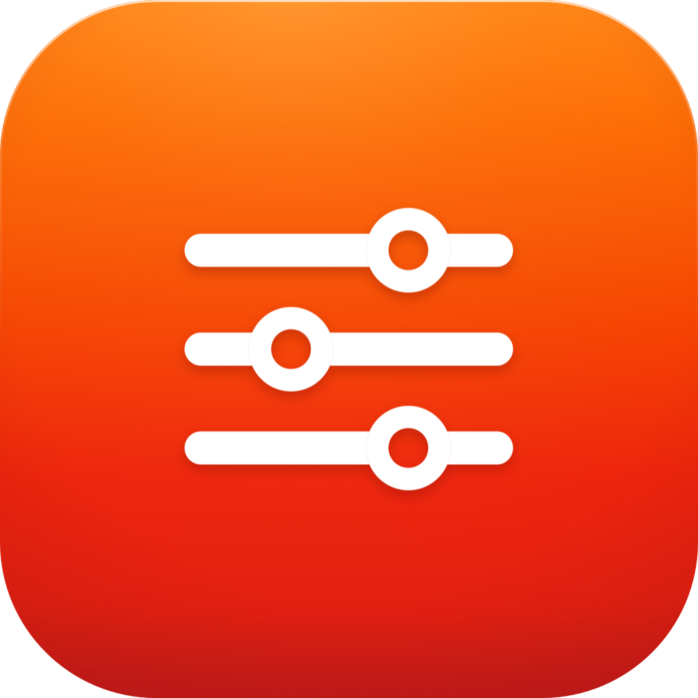

# Tweakd

**[tweakd.app](https://tweakd.app)** · Tune macOS. Or do it by hand.

A premium, **Apple-like menu-bar tweak tool for macOS** — think GNOME Tweaks, but
native SwiftUI on an apple.com-grey canvas with a single warm **orange→red accent
gradient**. Toggle reversible system optimizations, watch live CPU/RAM, benchmark the
gain, and run a guided setup that tailors everything to how *you* use your Mac.

> Personal build. **Not sandboxed** and locally (ad-hoc) signed, because it drives
> `pmset`, `mdutil`, `launchctl`, and `defaults` and escalates through the native
> macOS password prompt — none of which is possible inside the App Sandbox.



## Features

- **Dashboard** — live CPU, memory **and GPU** ring gauges (CPU/memory read straight from
  the Mach kernel and GPU from `AGXAccelerator`'s IO-registry counters — the same figure
  Activity Monitor shows, and no root needed — no shelling out; CPU smoothed so the menu and window stay consistent; sampling is
  ref-counted so it costs nothing when no gauge is on screen), a rolling 90-second chart,
  a **Clear RAM** button on the memory ring (purges inactive pages), system facts, and a
  **Core Audio Watchdog** that auto-restarts a runaway `coreaudiod` when a stuck audio
  stream (e.g. a virtual-audio HAL driver) pegs it.
- **Re-scan** — a progress modal that re-probes every tweak against the live system, then
  confirms with a summary of what's applied and **what changed since the last scan**.
- **Services** — every non-Apple `launchd` job (Homebrew databases and servers, vendor
  updaters, app helpers), with live state, **CPU/memory summed over each service's whole
  process tree**, and the **ports it's listening on**. **Stop** (until next login) or
  **Disable** (persists), individually or per group. Detection is reconciled against
  launchd itself, so app-registered background items (`SMAppService`, whose plist lives
  inside the app bundle) are found too. Security/EDR agents are listed **read-only**;
  Apple's daemons aren't listed at all.
- **Disk Cleanup** — measured, one-tap reclaim of caches, Xcode DerivedData, simulator
  junk, package-manager caches, orphaned leftovers from uninstalled apps, and Docker. A
  **Clean All** sweep runs the low-risk, non-destructive rows in one go — the Trash,
  Docker prune and iOS backups stay out of it and remain deliberate, confirmed actions.
- **Process Priority** — `renice` any running process (not just a curated list), with a
  busiest-processes table and optional apply-at-login.
- **Thermal & CPU speed** — reads macOS's own thermal-pressure level (shown as a
  four-rung ladder, Nominal → Critical, each rung spelling out what it costs you) and
  samples real per-cluster MHz against the hardware maximum, so you can tell *throttled*
  from *idle*. **Go live** streams those speeds once a second while admin is unlocked.
  No temperature is shown — Apple Silicon doesn't publish a die temperature to apps.
- **Audit trail** — every change is logged to the unified log (category `audit`) and to
  `~/Library/Logs/tweakd/tweakd.log`, recording before → intended → **actual** state.
- **51 tweaks** across 7 categories (Performance, Power, Snappiness, Privacy, Background
  Services, Network, AI & Intelligence) — CPU/GPU speed (raise GPU memory limit,
  unthrottle background I/O, server performance mode), RAM/GPU responsiveness (reduce
  transparency & motion), Finder/Dock snappiness (faster Mission Control, instant dock,
  no smooth-scroll, manual tabbing), network throughput (enlarge TCP buffers, raise
  socket backlog), and AI/bloat daemons (media/photo analysis, Siri, proactive
  intelligence/`duetexpertd`). Each has its **own SF Symbol icon**, is **reversible**,
  and shows a risk badge, live applied/stock state, and whether it needs admin or SIP-off.
  Advanced-risk tweaks confirm before enabling.
- **Presets** — one-tap bundles (Balanced · Performance · Snappy UI · Battery · Privacy ·
  AI / Server) that only include real, available tweaks (SIP-blocked and advanced ones
  are excluded).
- **Guided Setup** — a short wizard that asks how you use your Mac (AI, Spotlight,
  Photos, AirDrop, priority…) and builds a tailored set that never disables things
  you rely on.
- **Benchmark** — single-core, multi-core, memory-bandwidth and disk micro-benchmarks.
  Run a *Baseline*, apply tweaks, run *After tweaks*, and see the delta in a chart.
  Results are **saved to disk** and plotted on a **timeline**, and an opt-in **daily
  run** (noon by default) keeps the trend going on its own — postponed while the Mac is
  warm or busy, so a build never lands in the numbers.
- **Quick Actions** — one-shot maintenance: purge inactive memory, flush DNS, restart
  Dock/Finder, restart Core Audio, purge bloat daemons, rebuild Spotlight, and
  **generate an emergency revert script** (`~/Documents/tweakd_Revert.sh`) that undoes
  everything from Terminal.
- **Menu-bar panel** — live CPU/MEM tiles + a labelled sparkline (shows % used), quick
  toggles for your favorites, and Apply Recommended with an inline result message.
- **Favorites & reordering** — pin tweaks (★) for the menu-bar panel, drag to reorder
  within a category. Order and favorites persist.

## Documentation

Full docs live in [`docs/`](docs/):

- **[web/index.html](web/index.html)** — web docs: every tweak with its exact
  Terminal command and **click-to-copy** (works offline). This is also the page
  published at [tweakd.app](https://tweakd.app).
- **[docs/TWEAKS.md](docs/TWEAKS.md)** — every tweak + one-shot action with manual
  apply/revert commands. **You can do everything by hand — no app required.**
- **[docs/SERVICES.md](docs/SERVICES.md)** — background services: a tutorial plus the
  full `launchctl` cookbook (list, find failing, inspect, stop, disable, restart).
- **[docs/TOOLS.md](docs/TOOLS.md)** — Terminal equivalents for the other panes: Disk
  Cleanup, Process Priority, Thermal, Benchmark history, audit trail.
- **[docs/SAFETY.md](docs/SAFETY.md)** — `sudo`, SIP, reversibility, verification.
- **[docs/FAQ.md](docs/FAQ.md)** — high CPU, `coreaudiod`, "the app disappeared", more.
- **[docs/ARCHITECTURE.md](docs/ARCHITECTURE.md)** — how the app is built.
- **[docs/CONTRIBUTING.md](docs/CONTRIBUTING.md)** · **[docs/CHANGELOG.md](docs/CHANGELOG.md)**

## Naming

The bundle, the on-disk artifacts and every runtime identifier are lowercase `tweakd`,
matching the domain. Three places differ on purpose:

- **Display name:** **Tweakd** — capitalized, used for everything the user reads (window
  title, menu bar, docs, marketing).
- **Swift module / SPM target:** `Tweakd` — capitalized, per Swift convention. Invisible
  at runtime.
- **Bundle identifier:** `app.tweakd` — reverse-DNS of `tweakd.app`. Also the unified-log
  subsystem and the prefix for any LaunchAgent the app installs.

It was called **MacTweak** until 0.7.0. That rename changed the bundle identifier, which
is what macOS keys preferences on, so the app migrates its own state on first launch and
recognises the old names for the artifacts it wrote into root-owned or third-party files.
See [docs/FAQ.md](docs/FAQ.md#it-used-to-be-called-mactweak).

## Build & run

Requirements: **macOS 15+** and **Xcode 16+** (uses Swift 6 / Swift Charts).

```bash
# compile, bundle into app/build/tweakd.app, and launch (default)
app/build.sh

# build + bundle without launching
app/build.sh --no-launch

# debug build
app/build.sh --debug
```

The script kills any running instance first, compiles the `.icns` from
`app/Resources/AppIcon.iconset`, ad-hoc signs with `app/tweakd.entitlements`, stamps
the bundle version with the short git commit, and hides the `.app` extension in
Finder. Run `app/build.sh --help` for all flags.

Or open `app/Package.swift` in Xcode and hit Run (note: running the bare SPM executable
skips the `Info.plist`, so use the script for the real menu-bar experience).

The app lives in the **menu bar** and the **Dock**. The main window opens on first launch
and via the menu-bar panel's *Open Tweakd*.

## How privileges work

User-level tweaks (`defaults`, `launchctl … gui/$UID`) run without a prompt. Admin
tweaks run root either through `osascript … with administrator privileges` (native auth
dialog — no helper tool, no stored password, no deprecated API) or, once you've unlocked
passwordless admin (below), silently via `sudo -n`. The engine re-probes the real state
after every change, so a tweak is only shown *Applied* if the system actually changed —
it never trusts an exit code. See `app/Sources/Tweakd/Core/CommandRunner.swift` and
`TweakEngine.swift`.

## Passwordless admin (authenticate once)

By default each admin tweak triggers the native password prompt. Click **Unlock**
on the Dashboard's *Admin Access* card to authenticate **once** — Tweakd installs
a sudoers rule and every later admin tweak applies via `sudo -n` with no prompt.

- The rule lives at `/etc/sudoers.d/tweakd` (root-owned, `0440`, validated with
  `visudo -c` before it's kept).
- **Lock** removes it. Manual removal: `sudo rm /etc/sudoers.d/tweakd`.
- **Security note:** the rule grants your user passwordless root (`NOPASSWD: /bin/zsh`),
  which is what makes the tweaks silent. That's a real convenience-for-safety trade —
  fine for a personal machine, but any process running as you can then reach root
  without a password. Lock it when you're done tuning if that matters to you.

## Adding a tweak

Add one entry to `TweakCatalog.all` in
`app/Sources/Tweakd/Models/TweakCatalog.swift`:

```swift
Tweak(
    key: "my-tweak",
    title: "Human title",
    summary: "One line of what it does.",
    category: .performance, privilege: .admin, risk: .safe, sipRequired: false,
    applyCommand:  "sysctl -w some.knob=0",
    revertCommand: "sysctl -w some.knob=1",
    statusCommand: "sysctl -n some.knob",
    appliedWhenOutputContains: "0",   // stdout contains this → shown as Applied
    tags: [.prioritizePerformance], recommended: true
)
```

Give it a distinct icon with a one-line entry in `TweakCatalog.iconOverrides`
(`"my-tweak": "sparkles"`); it falls back to the category glyph if omitted. All
commands are verified against real macOS output — the app rejects tweaks that reference
sysctls/keys that don't exist rather than shipping dead toggles.

## Safety

- Everything is reversible. **Dashboard → Revert All** restores stock in one click.
- Admin/SIP tweaks are clearly badged. On a SIP-enabled Mac, SIP-required tweaks show
  as *Unavailable* and can't be toggled.
- All commands were verified against macOS 26 output formats.

## Regenerating the icon

```bash
swift scripts/make_icon.swift app/Resources/AppIcon.png
# then rebuild the .icns (see the iconset steps) and run app/build.sh
```

## Project layout

Top level follows one convention shared across these projects, so the same kind
of thing is always in the same place:

| Directory | Holds |
|---|---|
| `app/` | the application — `Package.swift`, `Sources/`, `Resources/`, `VERSION`, `build.sh`, entitlements |
| `web/` | the website: `index.html` — the page published at tweakd.app |
| `docs/` | all markdown — the tweak/service references, `backlog/`, `CHANGELOG.md`, `CONTRIBUTING.md` |
| `scripts/` | release and icon tooling |

Inside the app, all paths from the repo root:

```
app/Sources/Tweakd/
  App/        TweakdApp, AppModel (+ wizard logic), Theme (design system)
  Core/       CommandRunner (user/admin/passwordless), SystemInfo, TweakEngine
  Models/     Tweak, TweakCategory, TweakCatalog (+ iconOverrides), Presets
  Metrics/    SystemMetrics (Mach sampling, EMA-smoothed CPU), Benchmark
  Views/      Dashboard, TweakList/Row, Benchmark, Actions, Sidebar, Menu,
              Components (HeroHeader, RingGauge/StatTile, cpuHistoryMarks)
  Onboarding/ OnboardingView
app/build.sh              build, bundle, ad-hoc sign, launch
scripts/make_icon.swift   regenerate AppIcon.png
scripts/release-website.sh  deploy web/ to Cloudflare Pages
```
